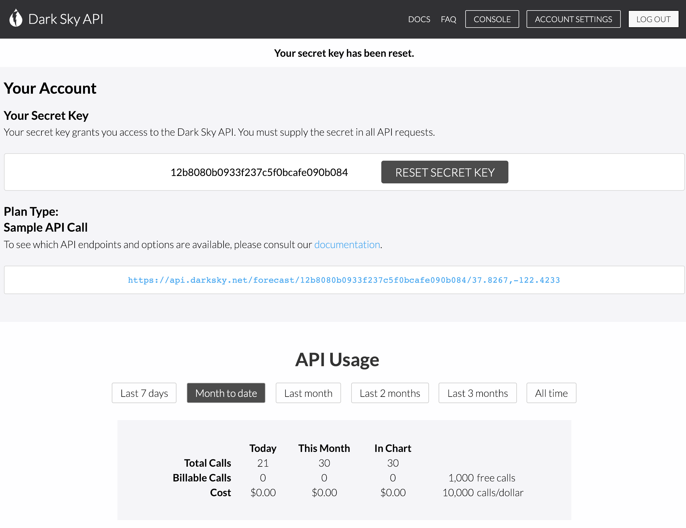

# WeatherApp

### A Weather App that showing the temperature.

###### Most apps in the world now need to download, post or even delete some data from the Internet. How do apps like Facebook, Instagram, Yelp work? They all use REST APIs and jSON. REST stands for REpresentational State Transfer. API is Application Programming Interface. And JSON is JavaScript Object Notation.

### App Stracture:

+ Design the UI in Storyboard with Auto Layout.
+ Used `Alamofire`. Alamofire is an HTTP networking library written in Swift.
+ Showing `Temperature`,`WeatherIcon` and `Summary` of the current weather.
+ Automatically select units based on geographic location.
+ Tested in two different timezones: `America/Los_Angeles` and `Europe/Athens`

---

---

+ Using the `Dark Sky API` 

---

